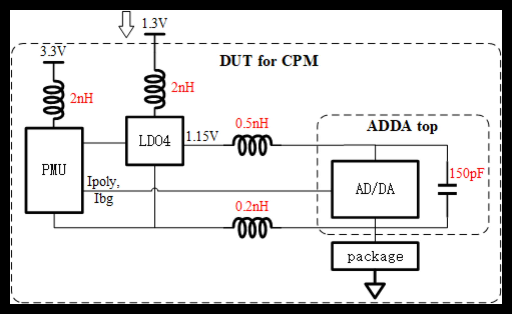
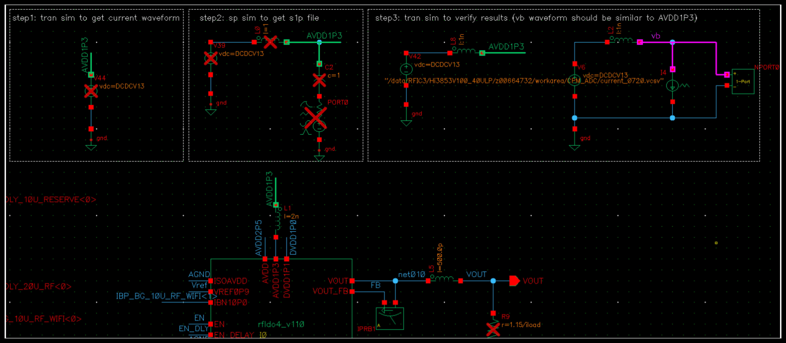

电源完整性和噪声影响的分析

Simulation principle:  

Testbench is shown as follows. We need to run simulations in 3 steps:
- step 1. Transient sim to get the current waveform and save as a .vcsv file (this will be used in step 3) 
- step 2. sp simulation to get s1p file (this will be used in step 3)
- step 3. Transient sim to verify the model.

