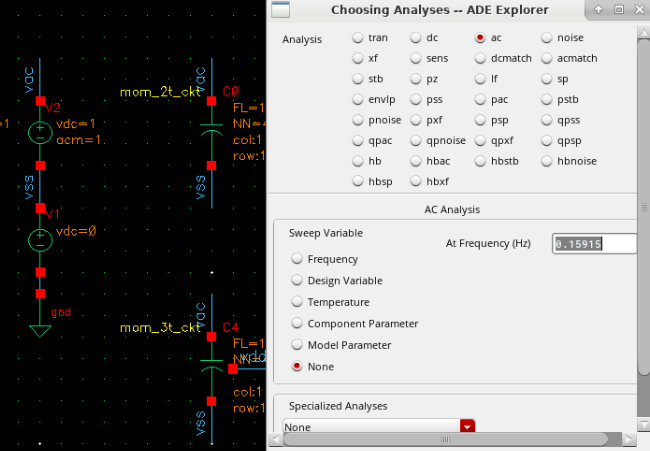

This post is to show how to run simulations with different views simultaneously.

---
# smic40_mom_cap_variation
1. PDK中MOM cap仿真结果：

2. 看看电容值偏差

从图中可以看到 $CV = 4.77/C$, CV (co-efficient of variation)是离散系数，C是电容均值。

把横轴改为1/C，可以更直观地看到CV和C成反比，其系数正是标准差σ。

SMIC40nm工艺，MOM电容的标准差σ=0.047fF (考虑PVT，大概在0.05fF左右)

附录：电容仿真

