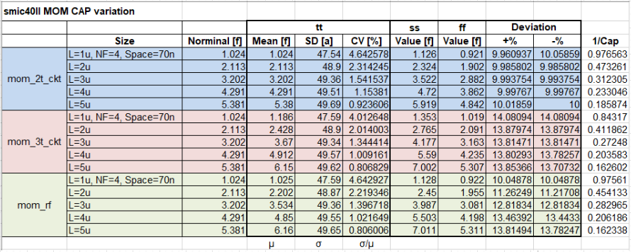
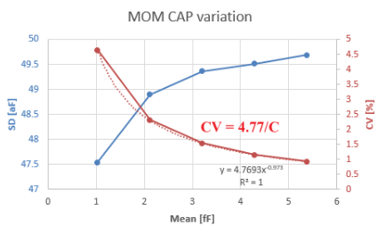
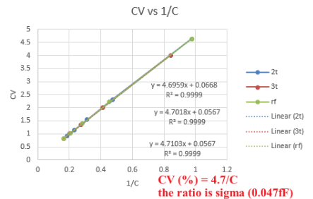

This post is to show how to run simulations with different views simultaneously.

---
# setup
1. In ADE assembler window, right click `Global Variables` and select `Add Config Sweep`.

3. Select the specific cell (NOT the testbench) and views needed.

